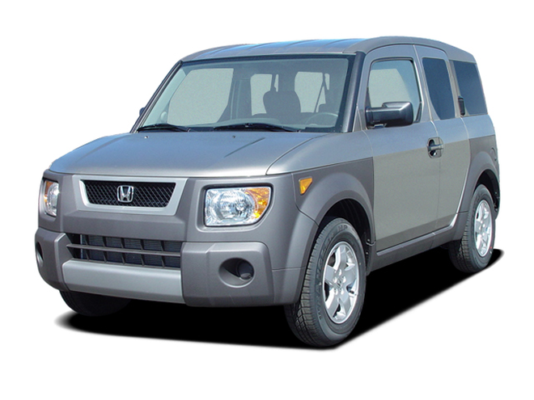

<html>
  <head>
    <meta charset="utf-8">
    <meta http-equiv="X-UA-Compatible" content="IE=edge,chrome=1">
    <title>✨Toaster Love✨</title>
    <meta name="viewport" content="width=device-width">
    <meta name="description" content="Toasters are teh hotness.">
    <link rel="icon" type="image/png" href="images/favicon.ico">

    <!-- RSS Y'all -->
    <link rel="alternate" type="application/rss+xml" name="Toaster" title="Toaster" href="#">

    <meta name="viewport" content="width=device-width, initial-scale=1.0, user-scalable=0, minimum-scale=1.0, maximum-scale=1.0" />
    <meta name="apple-mobile-web-app-capable" content="yes" />
    <meta name="apple-mobile-web-app-status-bar-style" content="white" />
    <link href='https://fonts.googleapis.com/css?family=Shadows+Into+Light' rel='stylesheet' type='text/css'>
    <link rel="stylesheet" type="text/css" href="style.css">
</head>

<body>

<header role="banner" class="headroom">
  <h1 class="title"><a href="/">Toasters and Hondas</a></h1>
</header>

 For a while now, I've been wanting to work my way through this series of image manipulations in <a href="http://una.im/bokeh/#💁"> Una's </a> blog. So finally I did. Here's the output, which is not exactly as she did it because I didn't want to use Sass, and also because well, toasters and Hondas are awesome. This is all stock photos from the great internets; that is not my honda. Stage 2 is my favorite, as well as the Toaster with the bubble bokeh applied as screen.

Stage 1: Making washed out Toasters and Hondas. The goal: achieve a washout effect on pics of Toasters and Hondas. Play around with color palettes.

<figure class="toaster-red">
<!---->
<figcaption>Red toaster - background-blend-mode: lighten, color was #CC0000</figcaption>
</figure>

<figure class="toaster-purple-washout">
<!---->
<figcaption>Purpletoaster - background-blend-mode: lighten, color was #B757EE</figcaption>
</figure>

<figure class="honda-yellow">
<!---->
<figcaption>Yellow Honda - background-blend-mode: lighten, color was #FFC433 </figcaption>
</figure>

<figure class="honda-drab-washout">
<!---->
<figcaption>Drab Honda - background-blend-mode: lighten, color was #A9B0A5</figcaption>
</figure>

 This Honda is the effect I was looking for. I got it by thinking about the main tone in this image (an olive green/drab color) and then selecting a lighter version of that color. That got fairly equal lightness across all channels.

Stage 2: Making Pretend 3D Toasters. The goal: awesomeness in all ways!

<figure class="toaster-darken">
<!---->
<figcaption>3D toaster - Using :after effects, cyan color was #0CF0F3; red color was #F31E0C</figcaption>
</figure>

 This toaster is "3D" -- the cyan toaster is on z-index 2 and the red toaster is on z-index3. Both are fixed at 400px and 400px. The cyan toaster has a 30px left margin to give it a left-shifted effect. The display is block. The red toaster doesn't have content. Each toaster has two backgrounds-- the image and the color, using background-blend-mode as lighten. The red toaster also uses mix-blend-mode as darken. That mode cancels out the lighten, resulting in the original color. I removed the outline from the original example because it looked bad.

<figure class="toaster-darken-2">
<!---->
<figcaption>3D toaster with perspective- Same as previous, but with perspective applied.</figcaption>
</figure>

 

 In this one, the cyan toaster has a 600px perspective and a 5 degree Y rotation. The red toaster has a -600px perspective and a -2.5 degree Y rotation. I can't tell much a difference between this one and the last one, except that the rotation kind of blocks my text.

Stage 3: Vignettes -- making Hondas look Old School. The goal: make the image appear to have been taken with a camera that permits in certain colors at the edges.

<figure class="honda-inset">
<!---->
<figcaption>Inset Shadow Honda - box-shadow: inset 0 0 100px black; background color was #FF69B4. </figcaption>
</figure>

Above, I accidentally left "lighten" on in the pink Honda, but I think it came out ok.

<figure class="honda-inset-2">
<!---->
<figcaption>Radial-Gradient Shadow Honda: a radial gradient is inset with a 60% stop in white and a circular shape.</figcaption>
</figure>

<figure class="honda-inset-3">
<!---->
<figcaption>Radial-Gradient FOGDOG Honda: The Honda is FOGDOG with background-blend-mode:lighten and the gradient has mix-blend-mode: difference.</figcaption>
</figure>

Stage 4: Bokeh -- making Toasters and Hondas look festive. The goal: Apply a background to an image to create a the effect of some kind of smudging on the picture.

<figure class="toaster-star">
<!---->
</figure>

 Star background is used as the :after background-image over the toaster, using mix-blend-mode: screen.

<figure class="toaster-bubble">
<!---->
<figcaption>Bubble background over toaster with mix-blend-mode: screen</figcaption>
</figure>
<figure class="toaster-bubble-2">
<!---->
<figcaption>Bubble background over toaster with mix-blend-mode: multiply</figcaption>
</figure>

 Screen seems a lot more "magical" to me. How it does this I'm still not really sure. But I will certainly be stealing this effect in the future.

Stage 5: Lomography -- making Toasters and Hondas look as if they were created from a roll of film that wasn't really developed very well... or something like that ("Lomography is very saturated, sometimes blurred, and contains unexpected light leaks").

<figure class="toaster-lomo">
<!---->
</figure>

The toaster has a filter of 5px applied. We have to use -webkit-filter on the mac.

<figure class="toaster-lomo-2">
<!---->
</figure>

Two radial gradients in yellow and FOGDOG are also used as backgrounds on the image, with a background-blend-mode of overlay

<figure class="toaster-lomo-3">
<!---->
</figure>

A really messed up, but cool mix of the Honda and Toaster. I used mix-blend-mode lighten for the merge between the two images, as well as the merge between the images and the gradients.

</body>

</html>